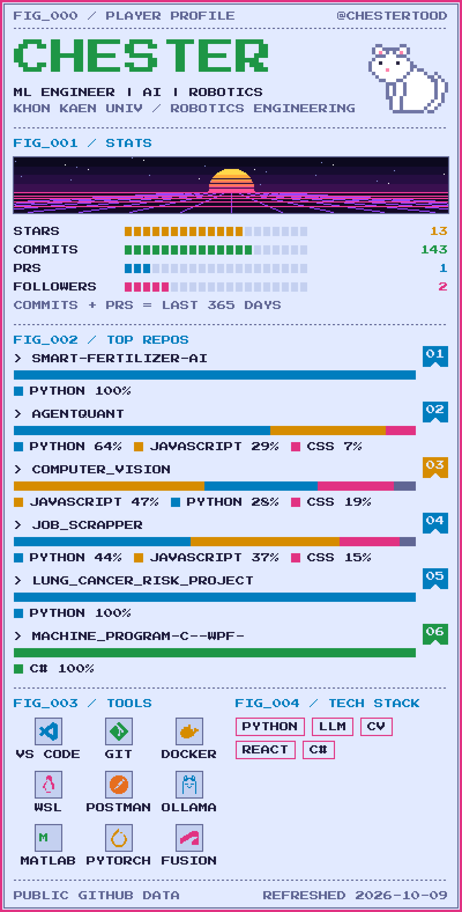

  <picture>
    <source media="(prefers-color-scheme: dark)" srcset="./assets/card-dark.gif" />
    
  </picture>

  
  
  
  
  
  

The card above refreshes automatically from public GitHub data. Source: <code>scripts/</code> + <code>config/profile.json</code>.

